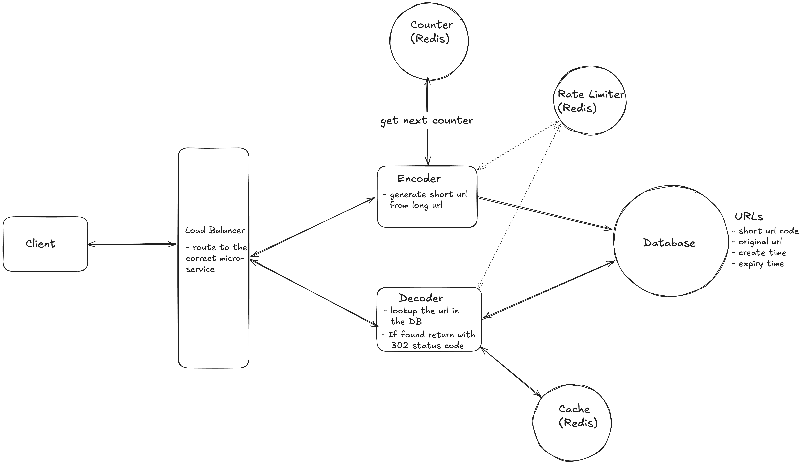

# URL Shortener

A production-oriented URL shortener built with **Go**, **Redis**, **DynamoDB**, **HAProxy**, and Docker.

The project is split into two stateless services:

- **Encoder** — creates short URLs
- **Decoder** — resolves short codes and redirects to the original URL
- **HAProxy** — public entry point and load balancer
- **Redis** — URL cache, distributed ID counter, and rate limiter
- **DynamoDB** — durable URL storage

---

## High-Level Design

The system is split into separate Encoder and Decoder services behind a load balancer.



## Architecture

```text
                         Client
                           |
                           | HTTP
                           v
                    +--------------+
                    |   HAProxy    |
                    |    :10002    |
                    +------+-------+
                           |
             +-------------+-------------+
             |                           |
       /api/v1/urls                 everything else
             |                           |
             v                           v
       +-----------+               +-----------+
       |  Encoder  |               |  Decoder  |
       |   :8080   |               |   :8080   |
       +-----+-----+               +-----+-----+
             |                           |
             |                           |
             +-------------+-------------+
                           |
                    +------+------+
                    |             |
                    v             v
                 Redis        DynamoDB
```

### Request routing

```text
POST /api/v1/urls  -> Encoder
GET  /{code}       -> Decoder
```

HAProxy also performs health checks against `/ping` on both backend services.

> Note: `/ping` through the public HAProxy endpoint is routed to the Decoder because the HAProxy frontend uses the Decoder as the default backend. HAProxy independently health-checks both Encoder and Decoder.

---

## Components

### Go

Provides:

- HTTP API
- Business logic
- URL validation
- short-code generation
- expiry handling
- redirect handling
- error handling

### Encoder

Responsible for:

1. Validate the long URL
2. Validate `expires_in`
3. Generate a distributed numeric ID using Redis `INCR`
4. Convert the ID to Base62
5. Store the URL in DynamoDB
6. Populate Redis cache
7. Return the short URL

### Decoder

Responsible for:

1. Validate the short code
2. Check Redis first
3. On cache miss, read DynamoDB
4. Validate URL expiry
5. Populate Redis
6. Return the original URL
7. HTTP layer sends the redirect

### Redis

Redis has three roles:

1. **URL cache**
2. **Distributed ID generation**
3. **Rate limiting**

### DynamoDB

DynamoDB is the durable source of truth for URL mappings.

It stores:

```text
code
long_url
created_at
expires_at
```

### HAProxy

HAProxy is the public entry point.

It:

- routes Encoder traffic
- routes Decoder traffic
- performs backend health checks
- forwards the original client IP using `X-Forwarded-For`

---

# API

Base URL:

```text
http://localhost:10002
```

## 1. Ping

```http
GET /ping
```

Response:

```json
{
  "message": "pong"
}
```

This endpoint is also used by HAProxy for backend health checks.

---

## 2. Create Short URL

```http
POST /api/v1/urls
Content-Type: application/json
```

### Without expiry

```json
{
  "url": "https://www.google.com"
}
```

### With expiry

```json
{
  "url": "https://www.google.com",
  "expires_in": 60
}
```

`expires_in` is the URL lifetime in seconds.

| Value | Meaning |
|---:|---|
| `0` | No expiry |
| omitted | No expiry |
| `60` | 1 minute |
| `3600` | 1 hour |
| `86400` | 1 day |
| negative | Invalid request |

Example response:

```json
{
  "code": "1",
  "short_url": "http://localhost:10002/1",
  "expires_at": 1780000000
}
```

`expires_at` is omitted when the URL does not expire.

Each create request generates a new short code, even when the long URL is the same.

---

## 3. Resolve Short URL

```http
GET /{code}
```

Example:

```http
GET /1
```

For a valid URL, the Decoder returns an HTTP `302` redirect to the original URL.

If the code does not exist:

```http
404 Not Found
```

If the URL has expired:

```http
404 Not Found
```

---

# Resolve Flow

Redis is the fast path.

```text
GET /{code}
      |
      v
    Redis
      |
   +--+--+
   |     |
  HIT   MISS
   |     |
   |     v
   |  DynamoDB
   |     |
   |     v
   |  Check ExpiresAt
   |     |
   |     v
   |  Populate Redis
   |     |
   +-----+
      |
      v
   Redirect
```

## Redis cache design

Redis stores:

```text
key:
url:<code>

value:
<long URL>
```

For expiring URLs, the Redis key receives a TTL equal to the URL's remaining lifetime.

For example:

```text
DynamoDB:
expires_at = 10:05:00

Current time:
10:04:20

Redis TTL:
40 seconds
```

This means Redis automatically removes the cached URL when its lifetime ends.

DynamoDB remains the durable source of truth.

The application still checks `expires_at` after a DynamoDB lookup because DynamoDB TTL cleanup is asynchronous.

---

# Short Code Generation

The Encoder uses Redis `INCR` as a distributed atomic counter.

```text
Encoder 1 ─┐
Encoder 2 ─┼──> Redis INCR
Encoder 3 ─┘
                |
                v
             1, 2, 3...
```

The numeric ID is converted to Base62:

```text
0-9
A-Z
a-z
```

Example:

```text
Redis ID -> Base62

1  -> 1
10 -> A
36 -> a
62 -> 10
```

DynamoDB also uses a conditional write:

```text
attribute_not_exists(code)
```

so an existing short code cannot be overwritten.

---

# Expiry

For an expiring URL:

```text
expires_at = current_time + expires_in
```

`expires_at` is:

- stored in DynamoDB
- returned in the create response
- used to calculate the Redis TTL

A request with:

```json
{
  "expires_in": -1
}
```

returns:

```http
400 Bad Request
```

because negative expiry is invalid.

A URL with:

```json
{
  "expires_in": 0
}
```

does not expire.

---

# Storage

DynamoDB table:

```text
Table: URLMappings

Partition key:
code (String)

TTL attribute:
expires_at
```

Example:

```json
{
  "code": "1",
  "long_url": "https://example.com",
  "created_at": "2026-09-13T00:00:00Z",
  "expires_at": 1780000000
}
```

`expires_at` is not part of the primary key. It is used as the DynamoDB TTL attribute.

---

# Rate Limiting

Redis is used for API rate limiting.

Current limits:

| Endpoint | Limit |
|---|---:|
| Create URL | 100 requests/minute/IP |
| Resolve URL | 300 requests/minute/IP |

When the limit is exceeded:

```http
429 Too Many Requests
```

Response:

```json
{
  "error": "rate limit exceeded"
}
```

Because the application is behind HAProxy, HAProxy forwards the original client IP using:

```http
X-Forwarded-For
```

The Go service uses this value when determining the rate-limit identity.

---

# Error Responses

## Invalid URL

```http
400 Bad Request
```

```json
{
  "error": "invalid URL"
}
```

## Invalid expiry

```http
400 Bad Request
```

```json
{
  "error": "invalid expiry"
}
```

## URL not found / expired

```http
404 Not Found
```

```json
{
  "error": "url not found"
}
```

## Rate limited

```http
429 Too Many Requests
```

```json
{
  "error": "rate limit exceeded"
}
```

---

# Running Locally

## Prerequisites

- Docker
- Go
- Postman (optional)

The recommended way to start the complete stack is the provided script.

From the repository root:

```bash
./buildscripts/runall.sh
```

The script starts:

```text
1. Docker network
2. Redis
3. DynamoDB Local
4. Encoder
5. Decoder
6. HAProxy
```

The public API is:

```text
http://localhost:10002
```

Redis is exposed locally on:

```text
localhost:10000
```

DynamoDB Local is exposed locally on:

```text
localhost:10001
```

HAProxy is exposed locally on:

```text
localhost:10002
```

Encoder and Decoder are intentionally not exposed directly to the host. HAProxy communicates with them through the Docker network.

---

# Docker Architecture

The project uses a single Dockerfile:

```text
buildscripts/build/Dockerfile
```

The service to build is selected using:

```text
SERVICE=encoder
```

or:

```text
SERVICE=decoder
```

Encoder image:

```text
urlshortener-encoder:latest
```

Decoder image:

```text
urlshortener-decoder:latest
```

The Dockerfile builds the selected service using:

```bash
go build ./${SERVICE}/cmd/restserver
```

---

# Useful Docker Commands

List containers:

```bash
docker ps
```

View all URL Shortener containers:

```bash
docker ps --filter "name=urlshortener"
```

View Encoder logs:

```bash
docker logs urlshortener-encoder
```

View Decoder logs:

```bash
docker logs urlshortener-decoder
```

View HAProxy logs:

```bash
docker logs urlshortener-haproxy
```

View Redis logs:

```bash
docker logs urlshortener-redis
```

View DynamoDB logs:

```bash
docker logs urlshortener-dynamodb
```

Stop the stack:

```bash
docker rm -f \
  urlshortener-haproxy \
  urlshortener-encoder \
  urlshortener-decoder \
  urlshortener-redis \
  urlshortener-dynamodb
```

---

# Testing

Run unit tests:

```bash
go test ./...
```

Run with the race detector:

```bash
go test -race ./...
```

Run static analysis:

```bash
go vet ./...
```

Build all Go packages:

```bash
go build ./...
```

---

# Project Structure

```text
urlshortner/
├── encoder/
│   ├── bl/                  # Encoder business logic
│   ├── cmd/restserver/      # Encoder server entry point
│   ├── dl/                  # Encoder DynamoDB data layer
│   ├── endpoint/            # Encoder endpoint layer
│   ├── inithandler/         # DynamoDB initialization / TTL
│   ├── model/               # Encoder request/response models
│   ├── svcerror/            # Encoder service errors
│   ├── svcparam/            # Encoder configuration
│   └── transport/http/      # Encoder HTTP layer
│
├── decoder/
│   ├── bl/                  # Decoder business logic
│   ├── cmd/restserver/      # Decoder server entry point
│   ├── dl/                  # Decoder DynamoDB data layer
│   ├── endpoint/            # Decoder endpoint layer
│   ├── inithandler/         # DynamoDB initialization / TTL
│   ├── model/               # Decoder models
│   ├── svcerror/            # Decoder service errors
│   ├── svcparam/            # Decoder configuration
│   └── transport/http/      # Decoder HTTP layer
│
├── pkg/
│   ├── ratelimiter/         # Redis-backed rate limiter
│   └── redis/               # Redis client/cache and ID generator
│
├── buildscripts/
│   ├── build/Dockerfile
│   ├── decoder/run_decoder.sh
│   ├── dynamodb/run_dynamodb.sh
│   ├── encoder/run_encoder.sh
│   ├── haproxy/haproxy.cfg
│   ├── haproxy/run_loadbalancer.sh
│   ├── redis/run_redis.sh
│   ├── default_env.sh
│   └── runall.sh
│
├── URL-Shortener.postman_collection.json
├── go.mod
├── go.sum
└── README.md
```

---

# Design Notes

## Why separate Encoder and Decoder?

The read and write paths have different scaling characteristics.

```text
Write:
Client -> HAProxy -> Encoder -> DynamoDB + Redis

Read:
Client -> HAProxy -> Decoder -> Redis
                              |
                              v
                           DynamoDB
```

The Decoder can be scaled independently because URL resolution is expected to be much more frequent than URL creation.

## Why Redis?

Redis provides:

- fast URL lookup
- distributed atomic ID generation
- rate limiting

## Why DynamoDB?

DynamoDB provides durable URL storage and supports:

- conditional writes
- partition-key lookups
- TTL configuration
- horizontal scaling

## Why HAProxy?

HAProxy provides:

- one public API endpoint
- request routing
- backend health checks
- load balancing capability
- client IP forwarding

---

# Future Scaling Improvements

The current implementation is intentionally simple enough for local development and interview practice.

Potential next steps:

1. Multiple Encoder replicas
2. Multiple Decoder replicas
3. HAProxy round-robin across replicas
4. Redis HA / replication
5. Atomic Redis rate limiter using Lua
6. Cache stampede protection / request coalescing
7. Metrics and distributed tracing
8. Distributed ID-generation alternatives
9. DynamoDB capacity and partition-key analysis
10. Hot-key handling for extremely popular URLs

---

# Postman

Import:

```text
URL-Shortener.postman_collection.json
```

The collection uses:

```text
http://localhost:10002
```

as the default API base URL.

Requests included:

- Ping
- Create Short URL
- Create Short URL with Expiry
- Resolve Short URL
- Invalid URL
- Invalid Expiry
- Not Found

The create request automatically saves the returned `code` into the collection's `short_code` variable, so the Resolve request can be run immediately after creating a URL.

---

## License

This project is for learning and system-design/interview practice.
